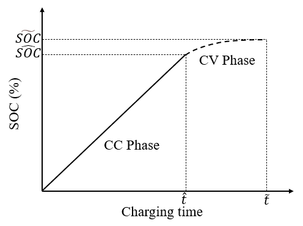

<!--
 * @Author: CQZ
 * @Date: 2024-09-13 16:16:30
 * @Company: SEU
-->
# Current Algorithm Version

## Origin

原版MAPPO，可以选择是否使用CTDE框架：

* 若`ctde=True`则为MAPPO
* 若`ctde=False`则为IAPPO

## Parameters Sharing (PS)

在原版的基础上增加了“参数共享”选项：

* 若`ps=True`则使用参数共享，所有智能体的Actor和Critic的参数相同
* 若`ps=False`则与Origin相同

# Current Env Version

* Agent State:
  * `agent_SOC`: 智能体电量
  * `exp_SOC`: 智能体离开时的期望电量
  * `agent_pos`: 智能体当前位置编号
  * `agent_usingtime`: 智能体当前用时
  * `agent_charging_ts`: 智能体累计充电次数
  * `agent_next_waiting`: 当前CS排队时间
  * `is_finish`: 是否完成行程
* Global State: `[所有智能体的状态] + [所有CS的排队时间]`
* Action: 智能体选择目标电量，即从当前电量充到目标电量，选择集为`[i/100 for i in range(0, 105, 5)]`，根据实时电量情况对动作进行掩码，使得所选动作一定大于当前电量，或者选择`0`表述不在此CS充电
* Reward: `-总等待时间-总充电时间-unfinished_penalty-unexpected_penalty-multi_times_penalty`，其中：
  * `unfinished_penalty=30`: 未完成行程惩罚
  * `unexpected_penalty=5`: 行程结束时未满足预留电量惩罚
  * `multi_times_penalty=0.5`: 多次充电惩罚，算法会计算在理想情况下，即道路上只有一个智能体的时候，该车完成行程所需要的最优充电次数，当当前充电次数大于最优充电次数时会受到惩罚。设置该值的原因是，场景目前假设充电时没有额外的时间耗费(如操作充电桩、停车等)，实验时发现若不对充电次数进行惩罚，则智能体倾向于少充多次，明显与现实不符
* 其它：
  * 设置最小保留电量为10%，当小于这个电量时智能体视为无法完成行程
  * 充电时间与充电量的关系和许多因素有关，这里进行了简化，采用下图曲线的分段线性形式：

  
