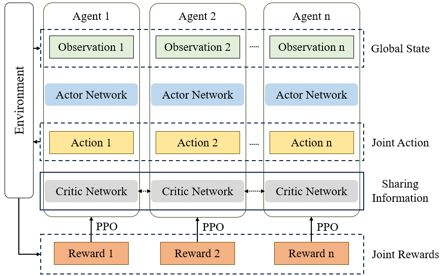

<!--
 * @Author: CQZ
 * @Date: 2024-09-13 15:02:36
 * @Company: SEU
-->
# Multi-agent Proximal Policy Optimization for Individual Charging Strategies of Electric Vehicles in Long-distance Trips

## 1.Overview

采用多智能体PPO算法(MAPPO)，为多个电动汽车(EV)生成充电方案。单一路径下，每个EV作为一个智能体，在拥有数个充电站(CS)的高速上行驶，每个智能体都是自利的，智能体之间通过可能的合作和竞争最小化各自的总通行时间(行驶时间+充电时间+排队时间)。

当EV到达某CS时，其根据当前电量、CS的排队状况等信息选择是否充电、充多少电，EV需要在完成行程的前提下，满足自身的预留电量需求。

MAPPO算法采用CTDE框架，架构如下：

## 2.Running

MAPPO原始版在`MAPPO/Origin`下，运行`train.py`开始训练，运行`evaluate.py`进行测试，PPO算法本身参数以外的参数含义如下：

|参数|类型|含义|
|-|-|-|
|`--sce_name`|`str`|环境调用的场景名称，即`env/scenarios/`下的场景代码文件名|
|`--filename`|`str`|训练保存文件名，神经网络参数文件将保存在`save/<sce_name>_<filename>`中，运行logs和输出文件也会类似命名保存在`logs`和`output`中|
|`--ctde`|`bool`|若为`True`则为CTDE框架下的MAPPO算法，若为`False`则为独立PPO算法|

场景介绍见[`env/README.md`](MAPPO/Origin/env/README.md)

## 3. Baseline Models

* [DS (Delay Strategy)](DS/README.md): 延迟策略是对现实情况的仿真，即驾驶员通常在电量即将耗尽时才会充电
* [DE (Differential Evolution Algorithm)](DE/README.md): 采用差分进化算法求解该场景

## 4.Results

见[`Result/README.md`](Result/README.md)

## 5. Current Version

见[`MAPPO/README.md`](MAPPO/README.md)

## 6.References

代码主要参考：

* <https://github.com/vwxyzjn/ppo-implementation-details>
* <https://github.com/vwxyzjn/cleanrl>
* <https://github.com/Eadd9/light_mappo-main>
